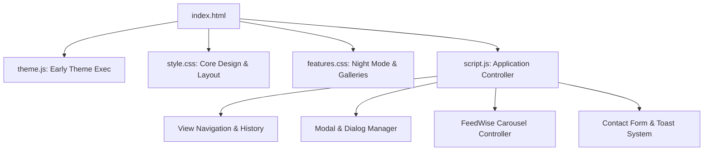

# System Patterns & Architecture

## System Overview

The portfolio is designed as a single-page, multi-view web application powered by semantic HTML5, modern CSS custom properties, and vanilla modular JavaScript.

## Key Technical Patterns

### 1. Zero-FOUC Theme Management Pattern

- **Script**: `theme.js` is included synchronously in `<head>` before stylesheets and DOM rendering.
- **Behavior**: Checks `localStorage.getItem('theme')` or system `window.matchMedia('(prefers-color-scheme: dark)')`, immediately applying `data-theme="dark"` or `data-theme="light"` to `document.documentElement`.
- **UI Sync**: When DOM loads, `script.js` synchronizes the toggle button's `aria-pressed` state and visual icon without reflow flash.

### 2. View Switching & URL Hash State Pattern

- **Sections**: All main views (`#home`, `#projects`, `#about`, `#skills`, `#contact`) exist within the DOM.
- **Controller**: Navigation clicks update URL hash, toggle `.active` classes on sections and navigation links, update `aria-current`, and scroll smoothly to the target.
- **Browser History**: Listens to `popstate` and `hashchange` to support browser back/forward navigation.

### 3. Accessible Dialog & Modal Pattern

- **Focus Management**:
  - Focus is trapped inside the active dialog container.
  - Initial focus is set to the first interactive element or close button.
  - Previous focus is restored to the initiating trigger upon closing.
- **Dismissal Hooks**:
  - Escape key press.
  - Backdrop click outside the modal card.
  - Explicit close button (`#closeModalBtn`).
- **Keyboard Navigation**: Left and right arrow keys cycle through gallery screenshots in project modals.

### 4. Styling Architecture & Design Tokens

- **Base Styles (`style.css`)**:
  - Design tokens in `:root` (colors, spacing, shadows, typography, radius).
  - Component layers: Navigation bar, hero section with 3D interactive effect, project cards, skill badges, and contact form.
- **Feature Layer (`features.css`)**:
  - Dark mode overrides (`[data-theme="dark"]`).
  - Gallery modal overlays and full-screen preview lightbox styles.
  - FeedWise screenshot carousel indicator and control button styling.
  - Cross-browser compatibility adjustments (e.g. `min-height: 0` for Firefox flex items, `rgba()` fallbacks for broad Chrome support).

### 5. Contact Flow Pattern

- Contact submissions prepare a formatted `mailto:` draft URI containing subject, sender details, and message body.
- Displays a toast notification notifying the user that their email application has opened.
- Keeps form inputs intact to prevent user data loss.
